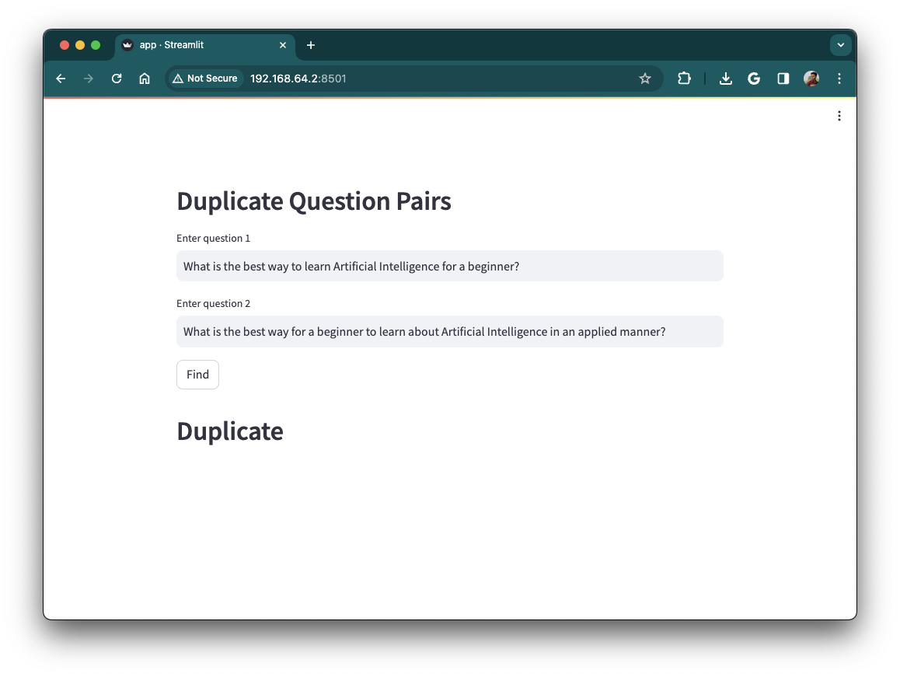

# quora-question-pairs




Clone the code
```
git clone https://github.com/gopalkatariya44/quora-question-pairs.git
```

Create venv
```
python -m  venv venv
source venv/bin/activate
```

Install requirements
```
pip install -r requirements.txt
```
- Using a notebook, create both the `model.pkl` and `cv.pkl` and place them in the models folder
- You can download stopwords.pkl [here](https://github.com/rasbt/python-machine-learning-book/blob/master/code/ch09/movieclassifier/pkl_objects/stopwords.pkl)


Run project
```
streamlit run main.py
```

After successfully running the code, visit: http://localhost:8501

### Link
[Medium Blog](https://gopalkatariya.medium.com/navigating-quora-question-pairs-a-step-by-step-guide-to-solving-the-problem-e05e07046d78)

